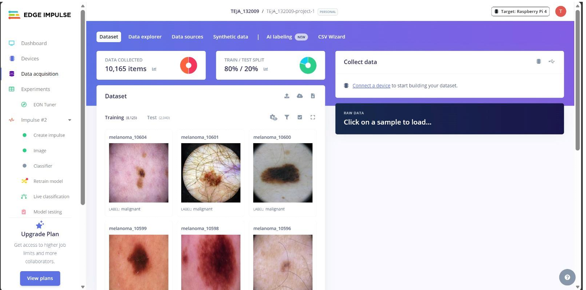
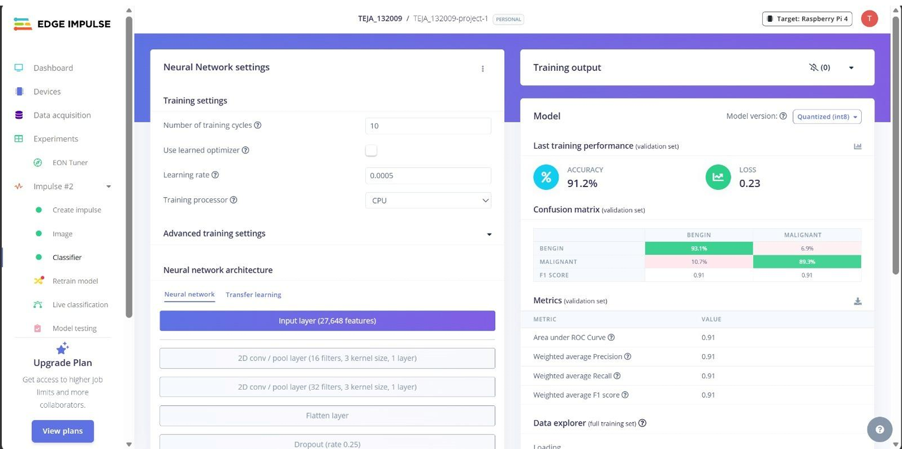
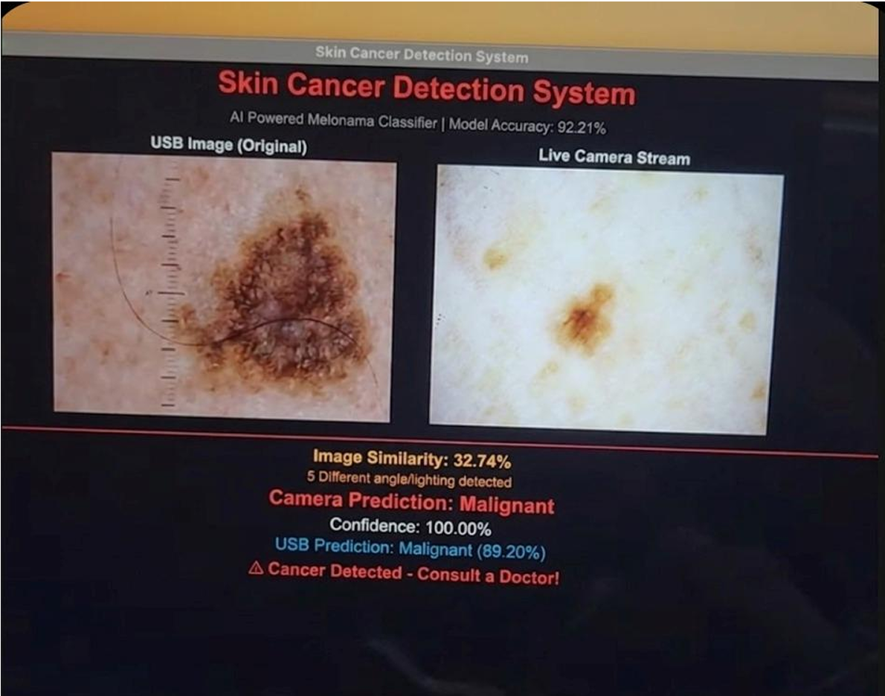

# 🔬 Skin Cancer Detection Using CNN on Raspberry Pi

> Real-time binary skin lesion classification (Benign vs Malignant) using lightweight CNNs deployed on Raspberry Pi 4 — no GPU required.

---

## 📌 Project Overview

This project implements and compares two lightweight CNN architectures for skin cancer detection, optimized for real-time inference on Raspberry Pi 4:

1. **Custom DSC-CNN** — Depthwise Separable Convolution CNN trained from scratch
2. **MobileNet** — Transfer learning based model

Both models are trained and evaluated across **10, 20, and 30 epochs** on the HAM10000 dermoscopic dataset. The trained PyTorch model (`.pth`) is directly deployed on Raspberry Pi 4 via a Python inference script with Pi Camera integration — no ONNX or TFLite conversion required.

The system outputs a clinician-advisory message with confidence score in under **1.3 seconds** per image on Raspberry Pi without any external GPU.

---

## 🖥️ Screenshots

### Edge Impulse Dataset



### Edge Impulse Training Output (91.2% Accuracy)


### Raspberry Pi Live Deployment


---

## 🎯 Key Results

### DSC-CNN (Custom — Trained from Scratch)

| Epochs | Accuracy |
|---|---|
| 10 | **92.3%** |
| 20 | 88.77% |
| 30 | 86.3% |

### MobileNet (Transfer Learning)

| Epochs | Accuracy |
|---|---|
| 10 | 91.2% |
| 20 | **88.43%** |

**Key finding:** DSC-CNN converges faster at low epochs but overfits beyond epoch 10. MobileNet with pretrained ImageNet weights gives more stable results across epochs.

- ✅ Real-time inference: **< 1.3s per image** on Raspberry Pi 4
- ✅ Model size: **< 8.5 MB**
- ✅ AUC-ROC: **0.91**
- ✅ No GPU required on deployment

---

## 🧠 Model Architectures

### 1. Custom DSC-CNN

```
Input (224×224×3)
    → Input Stem: 3×3 Conv + BN + ReLU6
    → 4× DSC Blocks (filters: 64, 128, 256, 256)
    → Global Average Pooling
    → Dropout (p=0.35)
    → Sigmoid Output (Benign / Malignant)
```

- **Parameters:** ~2.1 M
- **Model size:** ~8.5 MB
- **Computation reduction:** ~8.6× vs standard convolutions

### 2. MobileNet (Transfer Learning)
- Pretrained on ImageNet
- Final classification layer replaced for binary output
- Fine-tuned on HAM10000

---

## 📁 Repository Structure

```
skin-cancer-detection-raspberry-pi/
│
├── dsc_cnn_train.py                          # Custom DSC-CNN training script
├── mobilenet_trainingmodel.py                # MobileNet transfer learning training
├── evaluate.py                               # Model evaluation — accuracy, F1, confusion matrix
├── predict.py                                # Single image prediction
├── predict1.py                               # Prediction variant
├── auto_predict.py                           # Automated batch prediction on Pi
│
├── mobilenet_model_10_epoch.pth              # MobileNet — 10 epochs
├── mobilenet_20ep_88.43a.pth                 # MobileNet — 20 epochs (88.43%)
│
├── edge_impulse_10_epochs_92.1_accuracy.eim  # Edge Impulse ARM binary
├── edge_impulse_dataset.png                  # Edge Impulse dataset screenshot
├── edge_impulse_training.png                 # Edge Impulse training output screenshot
└── raspberry_pi_deployment_result_interface.png  # Live deployment GUI screenshot
```

---

## 📊 Dataset

**HAM10000** — Human Against Machine with 10000 training images

| Split | Images | Malignant | Benign |
|---|---|---|---|
| Train | 7,010 | 1,368 | 5,642 |
| Validation | 1,502 | 293 | 1,209 |
| Test | 1,503 | 293 | 1,210 |
| **Total** | **10,015** | **1,954** | **8,061** |

**Binary label mapping:**
- Benign → melanocytic nevi, benign keratoses, vascular lesions, dermatofibromas
- Malignant → melanoma, basal cell carcinoma, actinic keratoses

---

## ⚙️ Preprocessing Pipeline

1. Resize to **224×224** pixels
2. ImageNet normalization (mean = [0.485, 0.456, 0.406])
3. **Hair removal** — morphological black-hat filtering + inpainting (OpenCV Telea)
4. **CLAHE** — Contrast Limited Adaptive Histogram Equalization
5. Data augmentation — horizontal/vertical flips, ±15° rotation, zoom (0.9–1.1×), brightness jitter ±10%
6. Class-weighted oversampling — malignant weight = 4.0 (to handle 9:1 class imbalance)

---

## 🚀 Setup and Usage

### Requirements

```bash
pip install torch torchvision opencv-python pillow numpy scikit-learn seaborn matplotlib
```

### Train DSC-CNN

```bash
python dsc_cnn_train.py
```

### Train MobileNet

```bash
python mobilenet_trainingmodel.py
```

### Evaluate Model

```bash
python evaluate.py
```

### Run Inference

```bash
python predict.py --image path/to/image.jpg
```

---

## 🖥️ Raspberry Pi Deployment

**Hardware:**
- Raspberry Pi 4 (ARM Cortex-A72, quad-core, 4GB RAM)
- Raspberry Pi Camera Module v2 (Sony IMX219, 8MP)
- 7" HDMI Touchscreen

**Deployment flow:**
1. Train model on laptop GPU → save as `.pth`
2. Transfer `.pth` file to Raspberry Pi
3. Run `auto_predict.py` directly on Pi with PyTorch
4. Pi Camera captures live image → preprocessed → model inference → result displayed on screen

**Advisory output:**
- 🔴 Malignant OR confidence < 75% → *"Consult a Dermatologist — Do not self-diagnose."*
- 🟢 Benign AND confidence ≥ 75% → *"Likely Normal — Consult a doctor for confirmation."*

---

## 📈 Epoch-wise Accuracy Comparison

| Epochs | DSC-CNN (%) | MobileNet (%) |
|---|---|---|
| 10 | **92.3** | 91.2 |
| 20 | 88.77 | 88.43 |
| 30 | 86.3 | — |

---

## 📋 Classification Metrics (Test Set)

| Metric | Benign | Malignant | Weighted Avg |
|---|---|---|---|
| Accuracy | 91.2% | 91.2% | **91.2%** |
| Precision | 91% | 91% | 91% |
| Recall | 93.1% | 89.3% | 91% |
| F1-Score | 91% | 91% | **91%** |
| AUC-ROC | — | — | **0.91** |

---
## 📖 Additional Documentation

For detailed Raspberry Pi deployment instructions, see:

- [Raspberry Pi Deployment Guide](RASPBERRY_PI_DEPLOYMENT_GUIDE.md)

## 🏷️ Tech Stack

`Python` `PyTorch` `MobileNet` `OpenCV` `Edge Impulse` `EON Tuner` `Raspberry Pi 4` `Pi Camera` `HAM10000` `Tkinter` `Seaborn` `Matplotlib` `NumPy` `Scikit-learn` `ONNX` `TFLite` `INT8 Quantization` `Depthwise Separable CNN`

---

## 📄 License

For research and educational use only. Not intended for clinical diagnosis.
